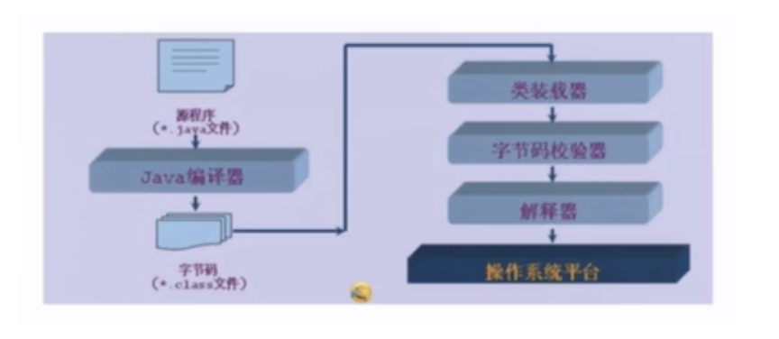
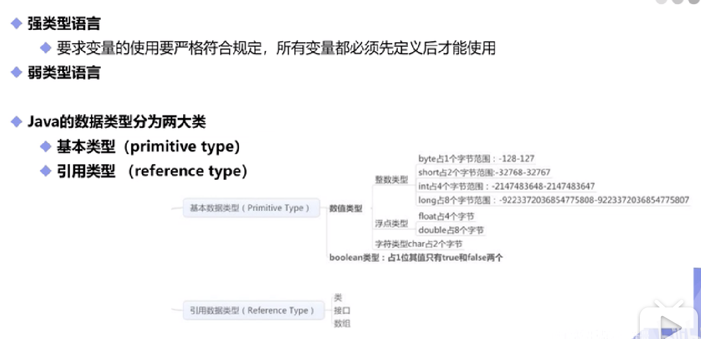
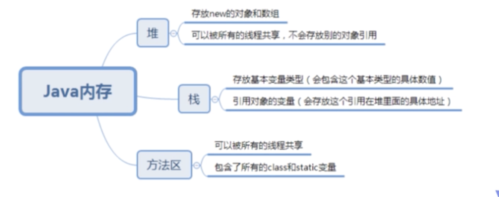
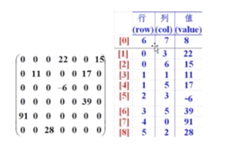
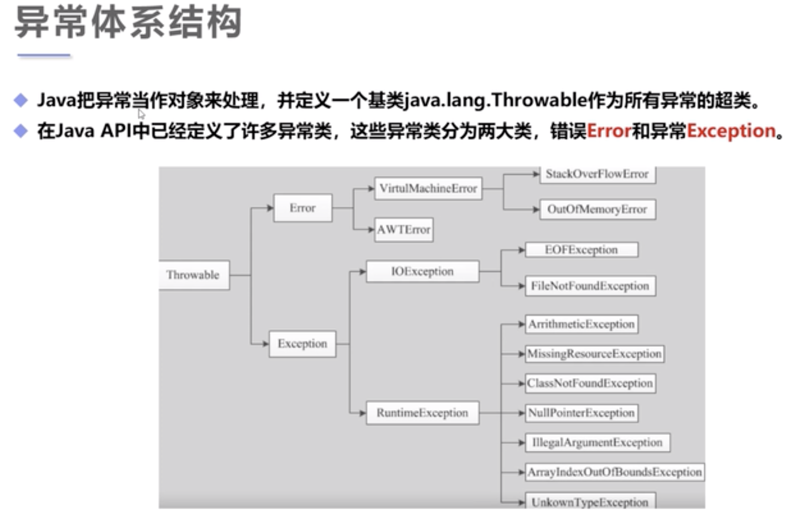

#	JAVA SE

## 预科

* Java背景

  * TIOBE。语言排行
  * 大数据hadoop 用java写的

* 学习和总结的能力（Blog） typecho

  * MarkDown Typora

    **hello** *hello* ***hello*** ~~hello~~

    ***

    ---

    > hello

    ```java
    
    ```

## 入门

* 人物了解：冯诺伊曼.    图灵
* 时间线。1972. C.     1982. C++.  1995. JAVA （没有指针， 没有内存管理，JVM可移植）
* 
* 基于java开发的：构建工具：ant maven jekins 应用服务器：tomcat jetty Jboss。。。Hadoop。  android。  
* 三高（可用，性能，并发）
* 优势：物联网发展的趋势
* JDK. JRE. JVM


* JAVA 安装

```bash_profile
export JAVA_8_HOME="$(/usr/libexec/java_home -v 1.8)"
export JAVA_11_HOME="$(/usr/libexec/java_home -v 11)"
alias jdk8='export JAVA_HOME=$JAVA_8_HOME'
alias jdk11='export JAVA_HOME=$JAVA_11_HOME'
export JAVA_HOME=$JAVA_11_HOME
```

* 编译器和解释器（时机： 先编译javac再解释）

  

## java基础

* 数据类型

  * 强类型语言。10.1F;  10L;

  

  * bit 位.   Byte 字节.  1B = 8 byte
  * 寻址能力。32位（4G内存）。64位（128G内存）
  * 二进制  0b  八进制 010;  8    十六进制 0x10; 16. 

  * BigDecimal 数据工具类。不要用float比较 

  * 所有字符本质都是数字。//编码 unicode 2字节。65536 Excel最长   U0000~UFFFF.  

    ```java
    // 转移字符
    // \t tab    \u  unicode
    char c3 = '\u0061';
    // a
    ```

* 类型转换

  ```java
  // 强制转换 （类型）变量名   高->低
  // 自动转换。低->高  byte, short, char -> int -> long -> float -> double
  ```

* 变量。常量 

  * 类变量 static。 实例变量

  * final。  

    > 修饰符：不存在先后顺序  static final xxx

* 运算符

  * instanceof 

  > cast 转换的意思

  ```java
  int b = a++; // 先赋值，后++
  //幂运算
  Math.pow(2, 3);
  A^B；//异或。 相同为真
  ~A; //取反
  >> 相当于*2
  << 相当于/2
  “” + a + b // ab   先转成string
  a + b + "" // c    先运算。后转string
  ```

* 包机制  （防止命名空间重复）

  

* JavaDoc

  ```java
  /**
  * @author
  * @version
  * @since 1.8 指定jdk版本
  */
  ```

  ```shell
  java -encoding UTF-8 -charset UTF-8   Xxx.java
  javac Hello.java  // 编译class文件
  java Hello			  // 运行class文件
  ```

  

## Java流程控制

* Scanner 扫描器，接收键盘数据。属于I/O流类 (java5)

  ```java
  Scanner scanner = new Scanner(System.in)
  	next() 空格结束符
    nextLine() 回车结束符	
    canner.close()
  ```

* 增强for (java5)

  ```java
  for(int x : numbers)
  ```

* break  continue 

  ```java
  // java没有goto, 用标签
  outer: for ... {
    ...
    continue outer;
  }
  ```

   

## Java 方法

* 重载
* 可变参数。（jdk1.5之后）

```java
// 指定类型后加省略号...
// 一个方法只能指定一个可变参数，必须放在方法最后一个参数
void test(int... numbers)

```

* 递归
  * ["尾调用"](http://www.ruanyifeng.com/blog/2015/04/tail-call.html) 空间复杂度从O(n) -> O(1)

```javascript
function factorial(n) {
  if (n === 1) return 1;
  return n * factorial(n - 1);
}

factorial(5) // 120
```

尾调用优化

```javascript
function factorial(n, total) {
  if (n === 1) return total;
  return factorial(n - 1, n * total);
}

factorial(5, 1) // 120
```

[柯里化](https://en.wikipedia.org/wiki/Currying)（currying）

```javascript
unction currying(fn, n) {
  return function (m) {
    return fn.call(this, m, n);
  };
}

function tailFactorial(n, total) {
  if (n === 1) return total;
  return tailFactorial(n - 1, n * total);
}

const factorial = currying(tailFactorial, 1);

factorial(5) // 120
```

**递归本质上是一种循环操作**。纯粹的函数式编程语言没有循环操作命令，所有的循环都用递归实现，这就是为什么尾递归对这些语言极其重要。对于其他支持"尾调用优化"的语言（比如Lua，ES6），**只需要知道循环可以用递归代替，而一旦使用递归，就最好使用尾递归。**


## 数组

```java
int[] nums; // 声明一个数组
int num2[];  // 为了迎合 c c++
nums = new int[arraySize]; // 创建
```

* 内存分析
  * 堆。栈。方法区



**方法区也属于堆**


> 数组本身是对象，**java中的对象是在堆中的**， 无论保存的是原始类型还是对象类型，**数组对象本身是在堆中**


> 1. Array ：数组，可以存储对象和基本数据类型，长度固定。
>
> 2. Collection接口：集合（单列），用于存储对象、不能存储基本数据类型（int，char等），但可以存储基本数据类型包装类（int-Integer，char-Character等），长度可变。
>
>    2.1 List（列表）特点：元素有放入顺序，元素可重复 
>    2.2 Map（映射）特点：元素按键值对存储，无放入顺序 
>    2.3 Set（集）特点：元素无放入顺序，元素不可重复（注意：元素虽然无放入顺序，但是元素在set中的位置是有该元素的HashCode决定的，其位置其实是固定的）
>
> List接口有三个实现类：LinkedList，ArrayList，Vector 
> LinkedList：底层基于链表实现，链表内存是散乱的，每一个元素存储本身[内存地址](https://www.baidu.com/s?wd=内存地址&tn=24004469_oem_dg&rsv_dl=gh_pl_sl_csd)的同时还存储下一个元素的地址。链表增删快，查找慢 
> ArrayList和Vector的区别：ArrayList是非线程安全的，效率高；Vector是基于线程安全的，效率低 
>
> 
> Set接口有两个实现类：HashSet(底层由HashMap实现)，LinkedHashSet 
> SortedSet接口有一个实现类：TreeSet（底层由平衡二叉树实现） 
> Query接口有一个实现类：LinkList 
>
> 
> Map接口有三个实现类：HashMap，HashTable，LinkeHashMap 
>  HashMap非线程安全，高效，支持null；HashTable线程安全，低效，不支持null 
> SortedMap有一个实现类：TreeMap 
>
>
> 其实最主要的是，list是用来处理序列的，而set是用来处理集的。Map是知道的，存储的是键值对 


* 数组工具类：Arrays 类 fill. sort. equal.....

* 冒泡排序  

  * 复杂度（时间和空间） (网上搜：数组排序算法)

    常见的算法时间复杂度由小到大依次为：***\*Ο(1)＜Ο(log\*2n\*)＜Ο(n)＜Ο(nlog\*2n\*)＜Ο(\*n\*2)＜Ο(\*n\*3)＜…＜Ο(\*2\*n)＜Ο(n!)\****

* 稀疏数组。 是一种数据结构，压缩数组

  

## 面向对象

* 构造函数

  如果有有参构造，想调用无参构造，必须显示定义无参构造函数

* 封装

  ***高内聚，低耦合***

* 继承 **extands** 

  * 所有类都继承Object

  * Java的类是单继承，没有多继承

  * super()  父类的构造方法 super(xx, xx)

    this()     本类的构造方法  this(xx, xx, xx)

  ```java
   //调用父类构造器，必须在第一行
  public Student(){
    // 隐藏代码，默认调用父类的无参构造
    super();
    ...
  }
  ```

  * 重写

    修饰符：范围可以扩大，但不能缩小 public > protected > default > private

    抛出的异常：范围可以被缩小，但不能扩大。

  类和类关系：依赖，组合，聚合。。。

* 多态

  * 动态编译，可扩展性

    ***类，接口，数组都是引用类型***

  ```java
  // 对象的实际类型是确定的
  new Student();
  new Person();
  // 指向的引用类型是不确定的，父类的引用可以指向子类
  Student s1 = new Student()
  Person s2 = new Student()  
  Object s3 = new Student()
  // 高低级别 s1 > s2 > s3
  // 对象执行的方法，要看左边的引用类型，s2不能调用s1独有的方法，重写的可以，s1可以自己和父类的方法
  s3.run() //子类重写父类方法，执行子类的方法
  (Student) s2.eat()
  
  ```

  **java 方法调用是运行的时候动态绑定**

  * 多态注意事项

    多态是方法的多态，属性没有多态

    父类和子类之间，继承关系，需要方法重写，父类引用指向子类

    不可重写的方法：static 方法。是类方法。final方法（可以重载）是放在常量池里的。private方法

  * instanceof。类型转换。引用类型

    ```java
    student_obj instanceof Student   //true
    student_obj instanceof Person    //true
    student_obj instanceof Object    //true
    student_obj instanceof Teather   //false  
    ```


* static关键字

  static是和类一起加载

  * 静态代码块

    ```java
    {
    	// 匿名代码块
      // 和对象一直产生，赋初始值等
    }
    
    static {
      // 静态代码块，类加载的时候执行，永久只执行一次
    }
    
    public Student() {
      // 构造方法
    }
    new Student() // 静态代码块 -> 匿名代码块 -> 构造函数
    new Student() // 匿名代码块 -> 构造函数
    ```

  * 静态导入包

    ```java
    import static java.lang.Math.random;
    import static java.lang.Math.PI;
    
    main(){
      // 直接用
      random();
      PI;
    }
    
    // 通过final修饰的类无法在继承
    public final class Math {
    
    }
    ```

* 抽象类。 是不能new的，只能子类实现， 是一种约束

  ```java
  // 抽象类   单继承， （接口可以实现多继承）
  public abstract class Action {
    // 抽象方法
    public abstract void doSomething();
  }
  ```

  **抽象类可以写普通方法，抽象的方法必须在抽象类里**

  

* 接口

  **专业的约束，约束和实现分离，面向接口编程， 接口是OOP的精髓**

  ```java
  public interface UserService {
    // 所有方法都是抽象的，public abstract
    void run(String name)
    // 所有属性都是常量 Public static final
    int AGE = 99;
  }
  
  public class UserServiceImpl implements UserService, 其他接口等... {
    public void run(String name) {
  		...
    }
  }
  ```

  ****

* 内部类

  ```java
  public class Outer {
    private int id = 0;
    private void out() {}
    
    //成员内部类 获得外部类的私有属性和方法
    public class Inner {
      public void in() {}
    }
    
    // 静态内部类
    public static class StaticInner {
      public void in() {}
    }
    
    // 局部内部类，现在方法里
    public void method(){
      class Inner {}
    }
    
    
  }
  
  // 一个java类中可以有多个class类，但只能有一个public class
  class A {
    public static void main(String[] args){}	
  }
    
  Outer.Inner inner = outer.new Inner()
  ```

  匿名类

  ```java
  public class Test{
    public static void main(String[] args) {
      new Apple().eat() // 匿名
      // 匿名内部类，没有类的名称，必须借助接口或者父类
      new UserService { // 匿名
        @Override
        public void hello() {...}
      }
    }
  }
  
  class Apple {
    public void eat(){}
  }
  
  interface UserService {
    void Hello();
  }
  ```

## 异常

* 检查性异常 -> 运行时异常 -> 错误(和jvm相关)

  

  超类Throwable

  ```java
  try {
    throw new ArithmeticException(); // 主动抛出异常
  }catch (Throwable e) {
    e.printStackTrace();//打印错误的栈信息
  }finally {
    
  }
  
  // throws在方法上
  public void test() throws Exception{
    
  }
  
  class MyException extends Exception {
    
  }
  ```


## 总结

https://www.bilibili.com/video/BV12J41137hu?p=80

## 集合...hashMap 原理

## 数据流

## 序列化volatile。transient  

## 泛型编程 <约束>

## lambda表达式

## 数组几大排序算法（了解）


